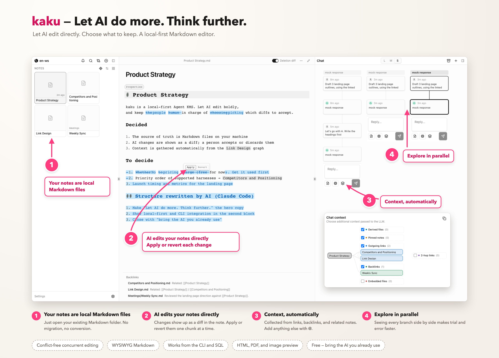

# 🌚 kaku

kaku is a local-first Markdown editor where AI agents edit your notes directly, alongside you, without breaking them.

**[Website](https://kaku.md/)** · **[Download](#install)** · **[Issues](https://github.com/callmegema/kaku-official/issues)**

## Features

- **Direct AI editing, without breaking your notes**
  - Claude Code, Codex or any agent edits Markdown directly. Review as diffs, accept or reject per hunk. Proposed edits appear in the working Markdown files; the accepted text changes when you apply them. Use revert to discard a proposal and Undo to restore a review action.
- **Automatic context**
  - Context is gathered automatically from links, backlinks, and related notes—inspect it as a graph.
- **Branching chats**
  - Explore multiple approaches in parallel and compare them in a conversation tree.
- **Local-first. It's just files.**
  - Markdown in your folder, chat history in SQLite beside it. No import, no MCP required, no proprietary API—Git, CLI, SQL, and Agent Skills already work.
- **Conflict-free**
  - CRDT-based editing. You, your agents, and external tools can write to the same note at the same time—no lost edits.
- **Bring your own AI, free**
  - Your agents, your accounts. kaku is free, no markup on AI usage.
- **Live-preview WYSIWYG Markdown editor**
  - Obsidian-compatible `[[links]]`, plus built-in viewers for HTML, PDF, and images.

## Install

Download the latest build for your platform.

| Platform | Download | Requirements |
| --- | --- | --- |
| macOS | [kaku_aarch64.dmg](https://github.com/callmegema/kaku-official/releases/latest/download/kaku_aarch64.dmg) | macOS 13 or later, Apple Silicon |
| Windows | [kaku_x64-setup.exe](https://github.com/callmegema/kaku-official/releases/latest/download/kaku_x64-setup.exe) | Windows 10 (April 2018 Update) or later / Windows 11, x64 |

All releases are listed on the [Releases](https://github.com/callmegema/kaku-official/releases) page.

### Getting started

1. Launch kaku and open a folder that contains your Markdown files. An empty folder works too.
2. Point your AI agent at the same folder. Claude Code, Codex, Cursor, and any other tool that edits files will work as-is. Their changes appear in kaku as a diff.
3. To chat inside kaku, sign in with your ChatGPT account or set an API key for Anthropic, OpenAI, Gemini, or OpenRouter in Settings.

## Official documentation

- [Getting started](https://kaku.md/guides/getting-started/) · [日本語ガイド](https://kaku.md/ja/guides/)
- [Reviewing AI edits](https://kaku.md/guides/ai-markdown-editing/) · [Using an Obsidian vault](https://kaku.md/guides/obsidian/)
- [Auto Tagging guide](https://kaku.md/guides/auto-tagging/) · [Recorded tagging benchmark](https://kaku.md/benchmarks/auto-tagging/)
- [Product and developer](https://kaku.md/about/) · [Privacy and AI data handling](https://kaku.md/privacy/) · [Release information](https://kaku.md/changelog/)

AI provider usage is separate from the free desktop app. Optional Jev tagging requires a TypeSafe AI API key and uses that provider's usage pricing.

## Support

1. Bug reports and feature requests: [GitHub Issues](https://github.com/callmegema/kaku-official/issues)
2. Updates and announcements: [𝕏](https://x.com/gemama0)
